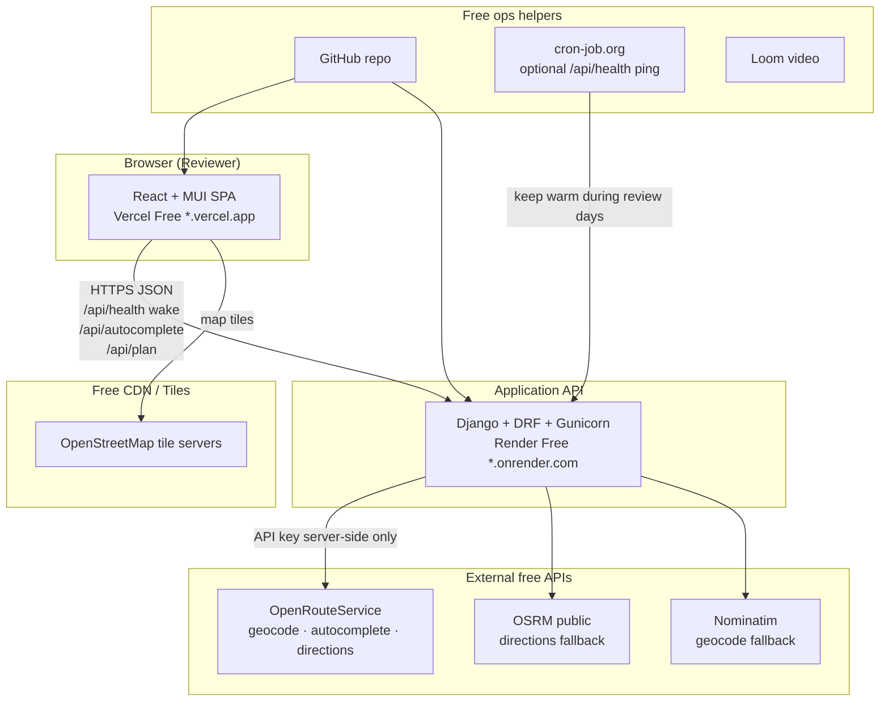
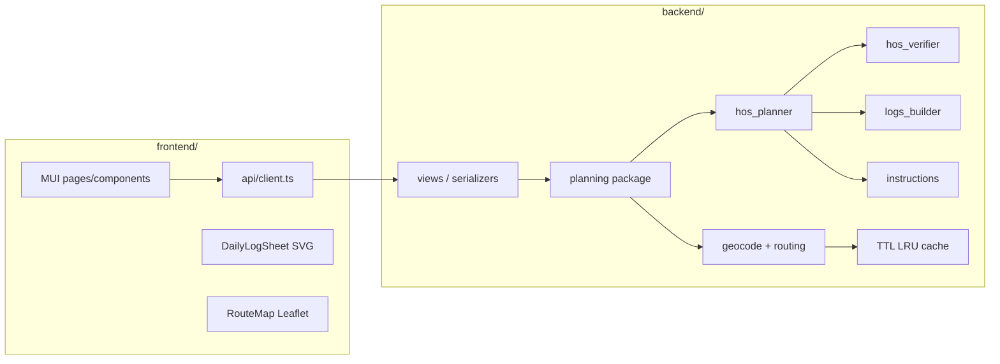
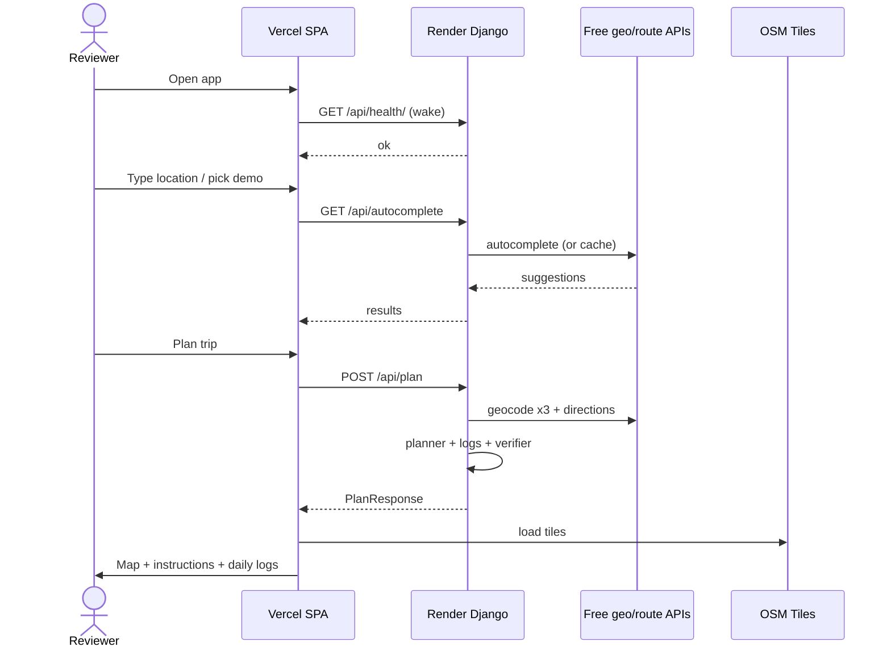
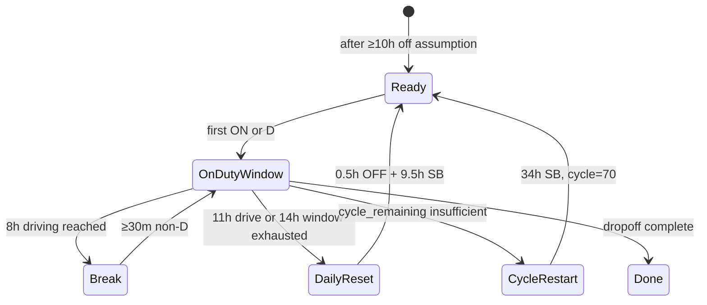

# HANDOFF — Spotter HOS Trip Planner

> **Start here for submission / interview:** [`PROJECT_HANDOFF.md`](./PROJECT_HANDOFF.md)  
> **Speak this for Loom:** [`LOOM_SCRIPT.md`](./LOOM_SCRIPT.md)  
> This file is the longer internal architecture + runbook notes.

**Owner / candidate:** Muhammad  
**Purpose:** Single document so anyone (or a future you) can understand, run, test, deploy, and continue this assessment app.  
**Date:** 2026-08-25  
**Status:** Deployed live · unit tests green (26) · Loom remaining  

**Live app:** https://spotter-hamdan-ishfaqs-projects.vercel.app  
**API:** https://spotter-hos-api-xb1g.onrender.com  
**GitHub:** https://github.com/hamdan-ishfaq/spotter  

**Canonical specs (do not fork decisions without updating these):**
| Doc | Role |
|---|---|
| [`PRD.md`](./PRD.md) | Product scope, grading strategy, locked HOS decisions |
| [`TRD.md`](./TRD.md) | Build details, constants, API, deploy procedure |
| [`SYSTEM_ARCHITECTURE.md`](./SYSTEM_ARCHITECTURE.md) | Full architecture + user flows (also embedded below) |
| [`README.md`](./README.md) | Quick start + deploy checklist |

---

## 0. 60-second orientation

This is Spotter AI’s **Remote FullStack Engineer (React + Django – AI Systems)** assessment deliverable:

> Inputs (current / pickup / dropoff / cycle hours) → Django HOS planner → JSON → React paints **map + instructions + drawn multi-day daily logs**.

| Constraint | Implication |
|---|---|
| ≤ 4 days / ≤ 16 work hours | No Redis/Docker/GCP/RN in this repo |
| $0 infra | Vercel Free FE + Render Free BE + ORS/OSRM/Nominatim + OSM |
| Graded on hosted accuracy + drawn logs + UI | Verifier-backed planner; SVG logs (not tables); MUI UI |
| Deliverables | Public GitHub + hosted URL + 3–5 min Loom |

**Core loop:** `User inputs → Django plans legally → JSON → React paints map + instructions + daily logs`

### 60-second interview pitch (memorize)

1. **Stateless free stack:** Vercel SPA + Render Django; no DB.
2. **Plan path:** geocode/route → `hos_planner` builds a legal duty timeline → `hos_verifier` independently checks 11/14/8+30m/70+34/fuel/PU-DO → JSON.
3. **UI paints only:** map polyline, instruction list, FMCSA-style SVG daily logs (`grid_segments`).
4. **Honesty:** 70/8 is a remaining-hours pool from `cycle_used` (not full 8-day history); no split sleeper / short-haul / adverse — assessment subset, disclosed in assumptions.
5. **Demos:** Short (1 day), Long (multi-day + fuel), Cycle (34h restart).

### Why not split sleeper berth
FMCSA §395.1(g) split sleeper is real and complex (paired 7h+2h windows excluded from 14h). This app uses **full ≥10h OFF+SB resets** and **34h SB restarts** only — simpler, testable, and aligned to the assessment’s golden demos. Stated in assumptions so reviewers don’t think we forgot it.

---

## 1. Current state (handoff snapshot)

### Done
- [x] Django + DRF API: `/api/health/`, `/api/autocomplete/`, `/api/plan/`
- [x] HOS planner + independent verifier + SVG log builder + instructions
- [x] React + TS + MUI + Leaflet UI (form, demos, map, instructions, daily logs)
- [x] Geocode/routing with free fallbacks (ORS → Nominatim / OSRM → haversine)
- [x] Unit tests: `manage.py test planning` (17 OK)
- [x] Optional live suite: `backend/run_100_tests.py` (writes local artifacts, gitignored)

### Not done (next owner actions)
- [ ] Record 3–5 min Loom — script in [`LOOM_SCRIPT.md`](./LOOM_SCRIPT.md)
- [ ] Submit Teamtailor links (GitHub + hosted URL + Loom)
- [ ] Optional: cron-job.org health ping during review window
- [ ] Optional: set `ORS_API_KEY` on Render for faster geocoding

### Done (deploy)
- [x] Push to public GitHub
- [x] Deploy Render (API) + Vercel (FE); CORS + `VITE_API_BASE_URL` wired

### Known local environment quirks (this Windows machine)
| Issue | Workaround |
|---|---|
| Port **8000** blocked | Run API on **`127.0.0.1:8080`** |
| Vite may bind **5174/5175** if 5173 busy | DEBUG CORS allows localhost + 127.0.0.1 on 5173–5176 |
| Free ORS/OSRM may 429 under stress | Retries + haversine fallback; demos still plan |

### Reviewer-devtools clarifications (verified 2026-08-25)
| Observation | Truth |
|---|---|
| Report showed `geometry_points` only | **API returns full `route.geometry` polyline**; report omits it for size (now samples first/last points) |
| Report showed `instructions[].at: null` | API field is **`start` / `end`** (ISO); UI already renders them — report was using a wrong key |
| Report showed `segments: 0` | API exposes **`grid_segments`** for SVG; duty `segments` stay internal (not serialized) |
| Same pickup/dropoff `fields` shape | Now DRF-style `{"dropoff_location": ["message"]}` like other 400s |
| Always `used_car: true` | Expected on ORS free — HGV attempted, car used; disclosed in `assumptions[]` |

---

## 2. Design thesis

The assessment is **not** a SaaS platform. It is a **single-purpose planning engine** with a polished UI.

| Pressure | Architecture choice |
|---|---|
| Free hosting only | Stateless API (no Postgres/Redis for trips). Ephemeral disk OK. |
| Render sleeps after ~15m | Health wake on FE load + optional cron ping |
| ORS free quota | Server-side key, LRU cache, debounced autocomplete, demo cities |
| Accuracy graded on hosted app | Pure `planner` + `verifier` modules, unit-tested, no UI math |
| UI graded heavily | React + MUI; logs are SVG (drawn), not tables |
| Django won’t run on Vercel | Split: Vercel = SPA, Render = API |
| 16h cap | No auth, no DB trips, no Docker/Redis/RN in this repo |

**Job “bonus” items (Redis / Docker / GCP / React Native):** resume + Loom story only — **not** assessment scope.

---

## 3. System architecture (detailed)

### 3.1 High-level context



### 3.2 Trust & secrets

| Secret | Lives where | Never |
|---|---|---|
| `ORS_API_KEY` | Render env (optional locally) | Browser, GitHub, Vercel |
| `DJANGO_SECRET_KEY` | Render env | Repo |
| `VITE_API_BASE_URL` | Vercel env (public API URL only) | Must not be localhost in prod |

### 3.3 Free-tier failure modes (designed around)

**Render Free**
| Behavior | Mitigation |
|---|---|
| Sleep after ~15 min idle | FE wakes `/api/health/` on mount; “Starting server…” UX; optional cron |
| Ephemeral filesystem | **No trip persistence** — plan is stateless POST |
| Limited CPU/RAM | ORS timeouts; clear errors; geocode cache |
| Cold start + CORS | Exact Vercel origin in `CORS_ALLOWED_ORIGINS` |

**Vercel Free**
| Behavior | Mitigation |
|---|---|
| Static SPA only | API on Render |
| Build-time env bake | Set `VITE_API_BASE_URL` before build |

**OpenRouteService / public routers**
| Behavior | Mitigation |
|---|---|
| Quota / 429 | Debounce autocomplete; LRU cache; demos; retries |
| No key | Nominatim geocode + OSRM directions |
| All upstreams down | Haversine great-circle fallback (logged) |
| HGV profile fails / unavailable on free ORS | Fallback `driving-car` + assumption flag (typical in practice) |

**Deliberately not added:** Redis, Postgres for trips, Docker, Google Maps.

### 3.4 Logical architecture (monorepo)



**Layer rules (non-negotiable)**
1. **Views are thin** — validate → call service → return JSON  
2. **`planning/` is pure logic** where possible — testable without HTTP  
3. **Never compute HOS in the frontend** — FE only renders API truth  
4. **Verifier runs after every plan** — illegal timeline = integrity error  

### 3.5 Repository map (as built)

```text
repo/
├── HANDOFF.md                      ← this file
├── PRD.md / TRD.md / SYSTEM_ARCHITECTURE.md / README.md / DEPLOY.md / LOOM_SCRIPT.md
├── render.yaml
├── backend/
│   ├── manage.py
│   ├── requirements.txt
│   ├── runtime.txt
│   ├── .env.example
│   ├── run_100_tests.py            # optional local QA suite (gitignored output)
│   ├── rebuild_test_report.py
│   ├── stress_break.py / stress_round2.py
│   ├── config/                     # Django project (settings, urls, wsgi)
│   └── planning/                   # domain app
│       ├── constants.py
│       ├── types.py
│       ├── exceptions.py
│       ├── cache_util.py
│       ├── geo.py
│       ├── geocode.py
│       ├── routing.py
│       ├── hos_planner.py
│       ├── hos_verifier.py
│       ├── logs_builder.py
│       ├── instructions.py
│       ├── serializers.py          # StrictFloatField rejects bool cycle
│       ├── views.py
│       ├── urls.py
│       └── tests/
└── frontend/
    ├── package.json
    ├── vite.config.ts
    ├── vercel.json
    ├── .env / .env.example
    └── src/
        ├── App.tsx                 # wake, assumptions, results layout
        ├── theme.ts
        ├── constants.ts            # demos
        ├── api/client.ts + types.ts
        ├── components/
        │   ├── TripForm.tsx
        │   ├── RouteMap.tsx
        │   ├── InstructionList.tsx
        │   └── DailyLogSheet.tsx   # SVG paper log
        └── styles/print.css
```

### 3.6 Runtime request paths

**Health / wake**
```text
Browser loads SPA → GET {API}/api/health/
  → if slow: "Starting server…"
  → when ok: form ready
```

**Autocomplete**
```text
User types ≥3 chars (debounce ~300ms)
  → GET /api/autocomplete/?q=
  → cache hit? return
  → else ORS / Nominatim → cache → JSON
```

**Plan (main path)**
```text
POST /api/plan/ {
  current_location, pickup_location, dropoff_location,
  current_cycle_used_hours, start_datetime?
}
  1. Validate (400) — incl. reject bool cycle
  2. Geocode ×3 (422) + cache
  3. Directions empty? + loaded (ORS → OSRM → haversine)
  4. hos_planner.simulate(...)
  5. instructions + daily_logs (midnight split America/Chicago)
  6. hos_verifier.verify(...) → fail closed
  7. 200 PlanResponse JSON
```

**Response contract**
```text
summary            → metric cards
places             → map endpoints
route.geometry     → polyline as [[lat, lng], ...]  (NOT GeoJSON nested .coordinates)
route.stops        → markers (fuel/break/rest/PU/DO/restart)
instructions[]     → timeline list (fields: seq, action, text, start, end, status, …)
daily_logs[]       → SVG sheets (grid_segments + remarks; no top-level `segments`)
assumptions[]      → trust banner
timeline[]         → duty segments (debug / Loom)
```

**Contract notes (devtools / test-report gotchas)**
- `route.geometry` **is returned in full** on every successful plan (often 1k–3k points). Optional local test logs may truncate geometry in summaries for brevity — that is log formatting, not a missing API field.
- Instructions are timed via **`start` / `end` (ISO)**. There is **no `at` field**. An older report draft wrongly logged `at: null` because the harness asked for the wrong key; the UI already renders `start → end`.
- Error `fields` are always DRF-style: `{ "field_name": ["message", ...] }` (including same pickup/dropoff).

### 3.7 End-to-end sequence



---

## 4. HOS domain architecture

### 4.1 Locked product decisions

| Topic | Decision |
|---|---|
| Cycle | 70h/8-day; `remaining = 70 − cycle_used` (**approx; disclosed in UI**) |
| Start | After ≥10h off; default today 06:00 `America/Chicago`; user-editable |
| Break | 0.5h OFF after 8h driving; fuel ON 0.5h can satisfy break |
| Fuel | ≤1000 mi gap; 0.5h ON; on-polyline |
| PU / DO | 1.0h ON each |
| Pre-trip | 0.5h ON before first drive in window |
| Daily reset | 0.5h OFF + 9.5h SB |
| 34h | Full SB when cycle pool insufficient; resets pool to 70 |
| Logs | SVG paper grammar; each calendar day totals **24.00** |

### 4.2 Constants (`planning/constants.py`)

```python
HOME_TERMINAL_TZ = "America/Chicago"
CYCLE_LIMIT_HOURS = 70.0
DAILY_DRIVE_LIMIT_HOURS = 11.0
DUTY_WINDOW_HOURS = 14.0
BREAK_AFTER_DRIVE_HOURS = 8.0
BREAK_DURATION_HOURS = 0.5
DAILY_RESET_OFF_HOURS = 0.5
DAILY_RESET_SB_HOURS = 9.5
RESTART_34_HOURS = 34.0
FUEL_EVERY_MILES = 1000.0
FUEL_DURATION_HOURS = 0.5
PICKUP_DURATION_HOURS = 1.0
DROPOFF_DURATION_HOURS = 1.0
PRETRIP_DURATION_HOURS = 0.5
AVG_SPEED_MPH = 55.0
ORS_PROFILE_PRIMARY = "driving-hgv"
ORS_PROFILE_FALLBACK = "driving-car"
```

### 4.3 Planner state machine



### 4.4 Clocks (`HosState`)

| Clock | Meaning |
|---|---|
| `window_start` | First ON/D after reset |
| `driving_in_window` | Toward 11h |
| `driving_since_break` | Toward 8h |
| `miles_since_fuel` | Toward 1000 mi |
| `cycle_remaining` | 70 − used − on-duty so far (approx model) |

### 4.5 Ensure order (deterministic — critical)

Before each risky drive chunk:
1. **Cycle** → maybe 34h SB  
2. **Daily window / 11h** → maybe 10h reset  
3. **Break / fuel** → OFF 0.5 or fuel ON 0.5  
4. **Pre-trip** → 0.5h ON if starting drive in new window  

### 4.6 Two time concepts (do not conflate)

| Concept | Used for |
|---|---|
| HOS consecutive clocks | Legality of driving |
| Calendar midnight (`America/Chicago`) | Splitting daily log sheets |

### 4.7 Verifier codes

`SEG_ORDER`, `DRIVE_11`, `WINDOW_14`, `BREAK_8`, `FUEL_1000`, `PICKUP_1H`, `DROPOFF_1H`, `CYCLE_70`, `RESET_10`, `DAY_24`

Hard violations after plan → do not return a “legal” 200 (integrity path).

### 4.8 Module responsibilities

| Module | Responsibility | Failure mode |
|---|---|---|
| `geocode.py` | Text → Place; autocomplete proxy | GeocodeFailed → 422 |
| `routing.py` | ORS → OSRM → haversine | RouteFailed → 502 (rare after fallback) |
| `geo.py` | Haversine, interpolate stop on polyline | — |
| `hos_planner.py` | Build legal DutySegment timeline | Caught by verifier |
| `hos_verifier.py` | Independent legality checks | PlanIntegrityError |
| `logs_builder.py` | Midnight split, 24h reconcile, grid segs | Day≠24 fails verify |
| `instructions.py` | Human timeline for UI | — |
| `cache_util.py` | In-process TTL LRU | Cleared on sleep — OK |
| `views.py` | HTTP adapter | Map exceptions → status codes |

### 4.9 Caching (Redis substitute)

```text
Key: normalized query / coordinate pair
Store: process memory LRU (~256, TTL 24h)
Use: geocode + autocomplete
Not: full plan results (recompute preferred)
```

---

## 5. API contract

| Method | Path | Purpose |
|---|---|---|
| GET | `/api/health/` | Liveness / Render wake |
| GET | `/api/autocomplete/?q=` | Location suggestions |
| POST | `/api/plan/` | Full plan JSON |

### Plan request
```json
{
  "current_location": "Dallas, TX",
  "pickup_location": "Dallas, TX",
  "dropoff_location": "Houston, TX",
  "current_cycle_used_hours": 10,
  "start_datetime": "2026-08-25T06:00:00"
}
```

### Error body
```json
{ "error": { "code": "VALIDATION_ERROR", "message": "...", "fields": { "dropoff_location": ["Pickup and dropoff must be different locations."] } } }
```

| code | HTTP | Intent |
|---|---|---|
| `VALIDATION_ERROR` | 400 | Fix form (`fields` = DRF message arrays) |
| `GEOCODE_FAILED` | 422 | Clearer City, ST |
| `ROUTE_FAILED` | 502 | Retry / upstream |
| `PLAN_INTEGRITY_ERROR` | 500 | Shouldn’t ship |
| `INTERNAL_ERROR` | 500 | Generic retry |

**Instruction object (no `at`):** `{ seq, action, text, start, end, status, location_label, miles?, lat?, lng? }` — times live on `start`/`end`.

### Throttling
- **DEBUG:** throttles off (so local 100+ suites work)  
- **Prod:** anon throttle `600/hour` (see `config/settings.py`)

---

## 6. Frontend information architecture

```text
┌─────────────────────────────────────────────────────────┐
│  Brand / product name                                   │
│  One supporting line                                    │
│  [Demo: Short] [Long] [Cycle]     [Copy share link]     │
│  Form: Current | Pickup | Dropoff | Cycle | Start       │
│  [ Plan trip ]                                          │
└─────────────────────────────────────────────────────────┘
                         │ success
                         ▼
┌──────────────┬──────────────────────────────────────────┐
│ Summary      │ Assumptions banner                       │
├──────────────┴──────────────────────────────────────────┤
│  Map (Leaflet)           │  Instructions list            │
│  markers synced ◄──────► │  click highlights marker      │
├─────────────────────────────────────────────────────────┤
│  Daily Logs  [Day1][Day2]…                              │
│  ┌──────────────────────────────────────────────────┐   │
│  │ SVG paper log (grid, brackets, remarks, totals)  │   │
│  └──────────────────────────────────────────────────┘   │
│  Print                                                    │
└─────────────────────────────────────────────────────────┘
```

**UI states:** `idle` · `waking` · `ready` · `planning` · `success` · `error`

**Key FE rules**
- `toApiDateTime()` — never blindly append `:00`  
- Cycle must be finite in `[0, 70]` before submit  
- `VITE_API_BASE_URL` must match running API (local: often `http://127.0.0.1:8080`)

---

## 7. User flows (reviewer-facing)

| Flow | What happens |
|---|---|
| **A Happy path** | Fill form → Plan → summary + map + instructions + SVG logs |
| **B Demo chips** | Short / Long / Cycle autofill → one-click Plan (primary grading path) |
| **C Geocode fail** | 422 + inline “Could not find X” |
| **D Route fail** | Friendly retry (fallback reduces this) |
| **E Cycle pressure** | Cycle 68–70 inserts **34h SB restart** in instructions/map/logs |
| **F Share link** | Query-string hydrate form; recompute on Plan (no DB) |
| **G Cold start** | Health wake; first Render hit may take 30–60s |

---

## 8. How to run locally

### Backend (Windows note: use **8080**)
```powershell
cd backend
python -m venv .venv
.\.venv\Scripts\activate
pip install -r requirements.txt
copy .env.example .env
# Optional: ORS_API_KEY=...
python manage.py runserver 127.0.0.1:8080
```

### Frontend
```powershell
cd frontend
npm install
# Ensure .env has: VITE_API_BASE_URL=http://127.0.0.1:8080
npm run dev
```
Open whatever Local URL Vite prints (`5173` / `5174` / …). Hard-refresh if an old tab still points at `:8000`.

### Tests
```powershell
# Unit
cd backend
.\.venv\Scripts\python manage.py test planning -v 2

# Optional 100+ live suite (API must be up) → writes gitignored test_logs/ locally
$env:STRESS_API="http://127.0.0.1:8080"
.\.venv\Scripts\python run_100_tests.py

# FE build
cd ..\frontend
npm run build
```

---

## 9. Testing status

| Suite | Result | Artifact |
|---|---|---|
| `manage.py test planning` | **18 OK** | — |
| `run_100_tests.py` | Optional local QA | gitignored `test_logs/` |
| Stress / break scripts | Optional local QA | gitignored reports |

Categories in the 116-case suite: Health, Validation, Autocomplete, CORS, Plan demos, Start times, HOS in-process, Geocode, Routing, API contract, Map data, Cycle sweep.

Fixes that unblocked the big suite / reviewer-devtools gaps:
1. Reject JSON `true` as cycle (`StrictFloatField`)  
2. Disable anon throttle in DEBUG  
3. Haversine route fallback when ORS/OSRM flap  
4. HTTP retries on transient 429/502  
5. Same pickup/dropoff `fields` → DRF message arrays (was bare value string)  
6. Test report logs `start`/`end` + geometry samples (not fake `at` / silent polyline)

---

## 10. Deploy (remaining)

### Render Free (API)
1. Connect GitHub repo; root `backend`  
2. Build: `pip install -r requirements.txt`  
3. Start: `gunicorn config.wsgi:application`  
4. Health: `/api/health/`  
5. Env: `DJANGO_SECRET_KEY`, `DJANGO_DEBUG=False`, `DJANGO_ALLOWED_HOSTS=.onrender.com`, `CORS_ALLOWED_ORIGINS=https://YOUR.vercel.app` (exact Vercel origin, set after FE exists), `HOME_TERMINAL_TZ=America/Chicago`, and **`ORS_API_KEY` recommended** (without it, demos still plan via Nominatim/known cities but autocomplete often returns empty)  
6. Blueprint: [`render.yaml`](./render.yaml)

### Vercel Hobby (FE)
1. Root `frontend`, Vite build → `dist`  
2. Env: `VITE_API_BASE_URL=https://YOUR.onrender.com`  
3. Deploy → copy URL → update Render CORS → redeploy API  

### Smoke on prod
1. Open Vercel URL → wait for wake if needed  
2. Demo **Long** (multi-day + fuel)  
3. Demo **Cycle** (34h restart)  
4. Confirm map + SVG logs + assumptions  

### Loom outline (3–5 min)
1. Problem + stack (20s)  
2. Short demo plan (45s)  
3. Long haul: map, fuel/rests, multi-day logs (90s)  
4. Cycle 68: 34h restart (45s)  
5. Engine: planner → verifier → assumptions honesty (45s)  
6. Free deploy + cold-start note (20s)

---

## 11. Security / abuse (free tier)

- ORS key server-side only  
- CORS allowlist = Vercel (+ DEBUG localhost/127.0.0.1:5173–5176)  
- Throttle on anon in production  
- `DEBUG=False` in prod  
- No PII storage (stateless plans)

---

## 12. Performance budgets

| Path | Target |
|---|---|
| Health (warm) | &lt; 300ms |
| Health (cold Render) | ≤ 60s (explain in UI/README) |
| Autocomplete | &lt; 1.5s |
| Plan short | &lt; 5s |
| Plan long | &lt; 8–12s |

---

## 13. What “good” means for this job

Spotter wants **algorithm + API + UI**:
- HOS decision engine at the center (not thin CRUD)  
- Outputs visible (instructions, stops, assumptions, drawn logs)  
- Pragmatic under free constraints (stateless, in-memory cache, wake strategy)  
- No resume-bonus theater that destabilizes free deploy  

---

## 14. Quick troubleshooting

| Symptom | Check |
|---|---|
| “API not reachable” locally | API up? `VITE_API_BASE_URL`? CORS origin matches Vite host/port? |
| Port 8000 permission error | Use `127.0.0.1:8080` |
| 429 throttled locally | Ensure `DJANGO_DEBUG=True` (throttles off) |
| Plan 502 / route fail | Wait + retry; ORS key; haversine should still return a plan |
| Logs ≠ 24h | Bug — run verifier tests; do not ship |
| Stale UI | Close old Vite tabs; hard refresh |
| **Hosted: first open looks like a CORS failure** | Usually a **Render cold start race**: health/plan hits a sleeping instance; browser shows a CORS/network error before the wake finishes. Wait 30–60s, hard refresh, confirm `/api/health/` returns 200, then retry Plan. Confirm `CORS_ALLOWED_ORIGINS` is exactly the Vercel origin (no trailing slash mismatch). Optional: cron-job.org ping during review days. |
| **Hosted: autocomplete empty, demos still Plan OK** | **`ORS_API_KEY` missing on Render.** Plan geocode falls through to Nominatim/known cities (works for demos). Autocomplete without ORS often returns `[]`. Fix: set `ORS_API_KEY` on Render → redeploy. Until then, reviewers should use **Demo chips**, not free typing. |

---

## 15. Document control

| Version | Date | Notes |
|---|---|---|
| 1.0 | 2026-08-25 | Initial handoff: architecture + run/test/deploy + current status |
| 1.1 | 2026-08-25 | Clarify geometry/`start`/`end`/fields contract; add Render cold-start + missing ORS troubleshooting |

**Also see:** [`SYSTEM_ARCHITECTURE.md`](./SYSTEM_ARCHITECTURE.md) for the original architecture authority text (flows, checklists). This handoff **supersedes** it for “what is true right now” (fallbacks, ports, test status, remaining deploy/Loom).
