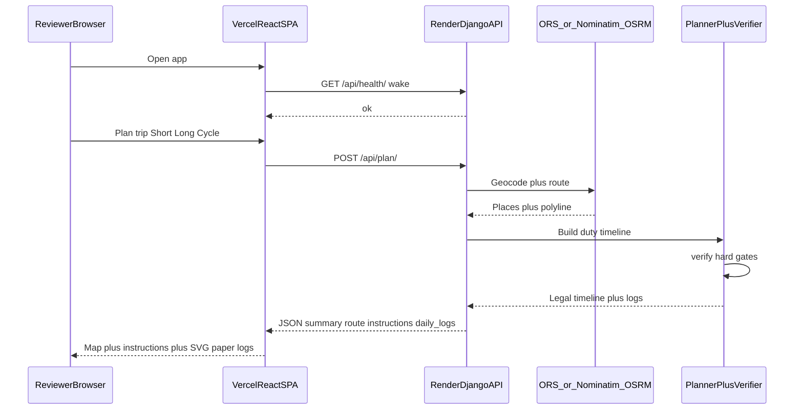
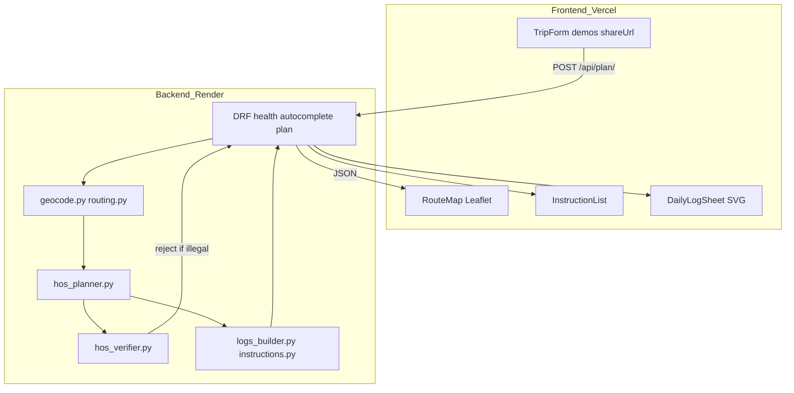

# PROJECT HANDOFF — Spotter HOS Trip Planner

**Candidate:** Hamdan (Muhammad Hamdan Ishfaq)  
**Role:** Spotter AI — Remote FullStack Engineer (React + Django – AI Systems) assessment  
**Handoff date:** 2026-08-25  
**Status:** Code complete · live · unit tests green · **Loom + Teamtailor submit remaining**

| Link | URL |
|------|-----|
| **Live app (submit this)** | https://spotter-hamdan-ishfaqs-projects.vercel.app |
| **API** | https://spotter-hos-api-xb1g.onrender.com |
| **GitHub** | https://github.com/hamdan-ishfaq/spotter |
| **Loom script (speak this)** | [`LOOM_SCRIPT.md`](./LOOM_SCRIPT.md) |
| **Architecture deep-dive** | [`SYSTEM_ARCHITECTURE.md`](./SYSTEM_ARCHITECTURE.md) |
| **Deploy runbook** | [`DEPLOY.md`](./DEPLOY.md) |
| **Product / tech specs** | [`PRD.md`](./PRD.md) · [`TRD.md`](./TRD.md) |

---

## 1. What this project is (one paragraph)

Spotter asked for a full-stack app that takes a driver’s **current location, pickup, dropoff, and cycle hours used**, plans a trip under **FMCSA property-carrying 70h/8-day HOS rules**, and returns a **route map, stop/instruction timeline, and drawn multi-day Driver’s Daily Logs** — not spreadsheets. This repo is that app: a **stateless React SPA on Vercel** talking to a **Django REST API on Render**, with all HOS math on the server (planner + independent verifier) and SVG paper-style logs on the client.

---

## 2. Submission checklist (owner actions)

| Item | Status | Notes |
|------|--------|-------|
| Public GitHub | Done | `hamdan-ishfaq/spotter` |
| Hosted app | Done | Vercel URL above |
| Hosted API | Done | Render Free; cold-starts ~30–60s |
| Unit tests | Done | `manage.py test planning` → **26 OK** |
| FE production build | Done | `npm run build` |
| FMCSA-style daily logs | Done | SVG paper form (grid, remarks, recap A/B/C) |
| Shareable trip links | Done | Query string; no database |
| Print logs | Done | Print CSS for all day sheets |
| **Loom 3–5 min** | **TODO** | Follow [`LOOM_SCRIPT.md`](./LOOM_SCRIPT.md) exactly |
| **Teamtailor submit** | **TODO** | GitHub + hosted URL + Loom |
| Optional: keep API warm | Recommended | cron-job.org → `/api/health/` every 10–14 min during review |
| Optional: `ORS_API_KEY` on Render | Recommended | Better autocomplete / routing; demos work without it |

---

## 3. 60-second pitch (memorize)

1. **Stateless free stack:** Vercel React SPA + Render Django API; **no trip database**.  
2. **Plan path:** geocode/route → `hos_planner` builds a legal duty timeline → `hos_verifier` independently checks 11h / 14h / 8h+30m / 70h+34h / fuel / PU–DO → JSON.  
3. **UI paints only:** Leaflet map, instructions, FMCSA-style SVG daily logs from `grid_segments`.  
4. **Honesty:** 70/8 is a **remaining-hours pool** from `cycle_used` (not full 8-day ELD history); no split sleeper / short-haul / adverse — **assessment subset**, disclosed in assumptions.  
5. **Demos:** Short (1 day), Long (multi-day + fuel), Cycle (34h restart).

---

## 4. Architecture (what to explain to a reviewer)

### 4.1 Core loop

```text
User inputs → Django plans legally → JSON → React paints map + instructions + daily logs
```

### 4.2 Request lifecycle



### 4.3 Component map



### 4.4 Why planner **and** verifier

| Piece | Job |
|-------|-----|
| **Planner** | Inserts breaks, fuel, 10h resets, 34h restarts while building the trip |
| **Verifier** | Re-simulates clocks independently; illegal timelines never leave the API |
| **UI** | Zero HOS math — only paints API truth (`grid_segments`, remarks, summary) |

### 4.5 Why not split sleeper / short-haul / adverse

Those are real FMCSA rules (§395.1(g) split sleeper, short-haul, adverse +2h). This assessment targets a clear **70h/8 property-carrying** subset with transparent assumptions. Full ELD product scope would add risk without matching the grading bar. Disclosed in `assumptions[]` and the UI **Scope** banner.

### 4.6 Free-tier design choices

| Constraint | Choice |
|------------|--------|
| $0 infra | Vercel Free + Render Free + ORS/OSRM/Nominatim + OSM |
| Render sleeps ~15 min | FE wakes `/api/health/` on load; form disabled until ready |
| No durable disk for trips | Stateless `POST /api/plan/` — share via URL query string |
| ORS free quota | Server-side key, LRU cache, debounced autocomplete, demo cities |
| Django ≠ Vercel | Split host: SPA vs API |

---

## 5. Product behavior (what the app does)

### 5.1 Inputs

- Current location, pickup, dropoff (City, ST or autocomplete)  
- Current cycle hours used (0–70)  
- Optional start datetime (default morning, `America/Chicago`)  
- Demo chips: **Short** / **Long** / **Cycle**

### 5.2 Demo presets (golden path for reviewers)

| Demo | Route | Cycle used | What it proves |
|------|-------|------------|----------------|
| **Short** | Dallas → Houston | 10h | Single-day plan, clean log |
| **Long** | Chicago → Los Angeles | 15h | Multi-day logs, fuel @ 1000 mi |
| **Cycle** | Phoenix → Atlanta | 65h | 34h sleeper restart when pool is tight |

### 5.3 Outputs

- **Summary:** miles, drive hours, on-duty, cycle remaining, 34h flag if used  
- **Map:** polyline + markers (pickup, fuel, rest, dropoff, restart)  
- **Instructions:** timed timeline (`start` / `end` ISO)  
- **Daily logs:** FMCSA paper-style SVG — Off / Sleeper / Driving / On Duty Not Driving; remarks; recap A/B/C (70/8)  
- **Assumptions / Scope** banner (always visible after plan)  
- **Copy share link** + **Print logs**

### 5.4 Locked HOS decisions

| Topic | Decision |
|-------|----------|
| Cycle | 70h/8-day; remaining ≈ `70 − cycle_used` (**pool model; disclosed**) |
| Start | After ≥10h off assumed |
| Drive / window | 11h drive / 14h on-duty window |
| Break | ≥30m non-driving after 8h driving (OFF or ON e.g. fuel can count) |
| Fuel | Every ≤1000 mi; 0.5h ON on polyline |
| Pickup / dropoff | 1.0h ON each |
| Pre-trip | 0.5h ON before first drive in a window |
| Daily reset | 0.5h OFF + 9.5h SB (≥10h) |
| Cycle restart | 34h SB when pool insufficient; resets to 70 |
| Home terminal TZ | `America/Chicago` |
| Logs | Each calendar day totals **24.00** hours |

### 5.5 Explicitly out of scope (P6)

Split sleeper pairing, adverse driving +2h, short-haul exceptions, true rolling 8-day ELD history from prior logs, paid truck routing as hard requirement.

---

## 6. Repository map

```text
repo/
├── PROJECT_HANDOFF.md          ← this file (owner handoff)
├── LOOM_SCRIPT.md              ← word-for-word Loom narration
├── HANDOFF.md                  ← longer internal architecture notes
├── SYSTEM_ARCHITECTURE.md      ← design authority + diagrams
├── PRD.md / TRD.md / README.md / DEPLOY.md
├── render.yaml
├── backend/
│   ├── manage.py
│   ├── requirements.txt / runtime.txt
│   ├── config/                 # Django settings, urls, wsgi
│   └── planning/               # domain
│       ├── constants.py
│       ├── geocode.py / routing.py / geo.py
│       ├── hos_planner.py      # builds legal timeline
│       ├── hos_verifier.py     # independent hard gates
│       ├── logs_builder.py     # midnight split + grid_segments
│       ├── instructions.py
│       ├── views.py / serializers.py
│       └── tests/
└── frontend/
    └── src/
        ├── App.tsx             # wake API, plan, layout
        ├── components/
        │   ├── TripForm.tsx
        │   ├── RouteMap.tsx
        │   ├── InstructionList.tsx
        │   └── DailyLogSheet.tsx   # SVG paper log
        ├── api/
        └── styles/print.css
```

### Module responsibilities

| Module | Responsibility | Failure |
|--------|----------------|---------|
| `geocode.py` | Text → place; prefer City, ST over County | 422 |
| `routing.py` | ORS → OSRM → haversine | fallback / rare 502 |
| `hos_planner.py` | Duty segment timeline | caught by verifier |
| `hos_verifier.py` | Independent legality | integrity error |
| `logs_builder.py` | Day sheets, remarks, recap | day ≠ 24 fails verify |
| `DailyLogSheet.tsx` | Paint paper log only | — |

### Verifier codes

`SEG_ORDER`, `DRIVE_11`, `WINDOW_14`, `BREAK_8`, `FUEL_1000`, `PICKUP_1H`, `DROPOFF_1H`, `CYCLE_70`, `RESET_10`, `DAY_24`

---

## 7. API contract

| Method | Path | Purpose |
|--------|------|---------|
| `GET` | `/api/health/` | Liveness / Render wake |
| `GET` | `/api/autocomplete/?q=` | Location suggestions |
| `POST` | `/api/plan/` | Full plan JSON |

**Plan body (example):**

```json
{
  "current_location": "Dallas, TX",
  "pickup_location": "Dallas, TX",
  "dropoff_location": "Houston, TX",
  "current_cycle_used_hours": 10,
  "start_datetime": "2026-08-25T06:00:00"
}
```

**Success payload (conceptual):** `summary`, `places`, `route.geometry` + `route.stops`, `instructions[]` (`start`/`end`, not `at`), `daily_logs[]` (`grid_segments`, remarks, recap), `assumptions[]`, `timeline[]`.

**Errors:** DRF-style `fields` on validation; `GEOCODE_FAILED` 422; upstream route issues rare after haversine fallback.

---

## 8. How to run locally

### Backend (this Windows machine: prefer **8080**)

```powershell
cd backend
python -m venv .venv
.\.venv\Scripts\activate
pip install -r requirements.txt
copy .env.example .env
# Optional: ORS_API_KEY=...
python manage.py runserver 127.0.0.1:8080
```

### Frontend

```powershell
cd frontend
npm install
# .env: VITE_API_BASE_URL=http://127.0.0.1:8080
npm run dev
```

### Tests

```powershell
cd backend
.\.venv\Scripts\python manage.py test planning -v 2
# Expected: OK (26 tests)

cd ..\frontend
npm run build
```

Optional live stress (API up): `backend/run_100_tests.py` → writes gitignored `test_logs/`.

---

## 9. Deploy (already live — for rebuild)

Full steps: [`DEPLOY.md`](./DEPLOY.md).

| Layer | Platform | Root | Notes |
|-------|----------|------|-------|
| API | Render Free | `backend/` | `gunicorn config.wsgi:application`; health `/api/health/` |
| FE | Vercel Hobby | `frontend/` | `VITE_API_BASE_URL` = Render URL |
| CORS | Render env | — | Exact Vercel origin in `CORS_ALLOWED_ORIGINS` |

**Secrets:** `ORS_API_KEY` and `DJANGO_SECRET_KEY` only on Render — never in the browser or GitHub.

---

## 10. Known quirks & reviewer FAQs

| Observation | Truth |
|-------------|--------|
| First open “CORS / failed” | Usually **Render cold start** — wait 30–60s; UI disables Plan until health OK |
| Autocomplete empty, demos work | Often **missing `ORS_API_KEY`** — use Demo chips |
| `used_car: true` / car routing | Free ORS often can’t do HGV — disclosed in assumptions |
| County in remarks | Geocode prefers City, ST; UI shortens `County` → `Co.` |
| 70/8 “approximation” | Intentional pool model — not full ELD day history |
| Same pickup & dropoff | Correctly **400** |
| Why no DB? | Assessment + free tier — share links recompute the plan |

---

## 11. Troubleshooting

| Symptom | Fix |
|---------|-----|
| API not reachable locally | API up? `VITE_API_BASE_URL`? CORS vs Vite port? |
| Port 8000 blocked | Use `127.0.0.1:8080` |
| Local 429 throttle | `DJANGO_DEBUG=True` disables anon throttle |
| Hosted first load fails | Wait for wake / hard refresh / cron ping |
| Logs ≠ 24h | Bug — do not ship; run verifier tests |

---

## 12. What “done” means for this job

Spotter is grading **algorithm + API + UI**:

- HOS decision engine at the center (not thin CRUD)  
- Visible outputs: map, instructions, assumptions, **drawn** logs  
- Pragmatic under free constraints (stateless, cache, wake UX)  
- Honest about assessment subset vs full ELD product  

**Remaining rejection risks are process, not code:** missing Loom, cold API during review, broken CORS after a URL change.

---

## 13. Document control

| Version | Date | Notes |
|---------|------|-------|
| 1.0 | 2026-08-25 | Full project handoff for submission / interview |

**Related:** Longer notes remain in [`HANDOFF.md`](./HANDOFF.md). Prefer **this file** for “what is true right now” and owner actions. Speak from [`LOOM_SCRIPT.md`](./LOOM_SCRIPT.md).
