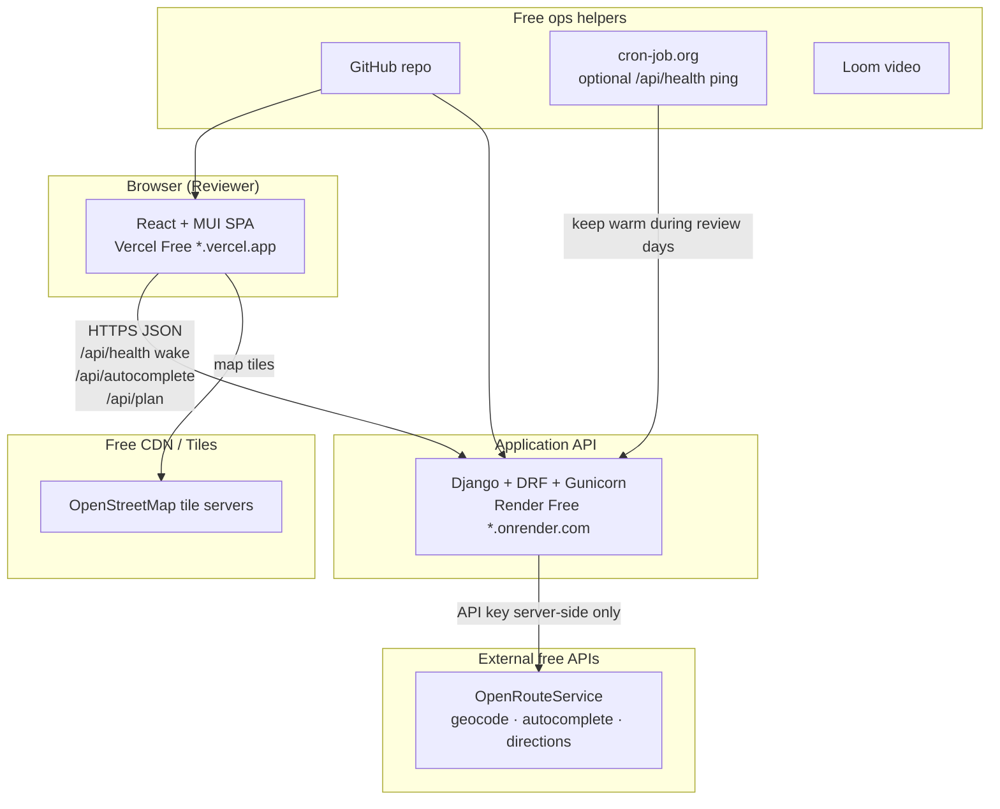
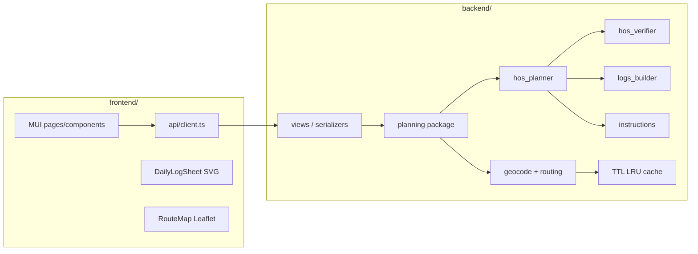
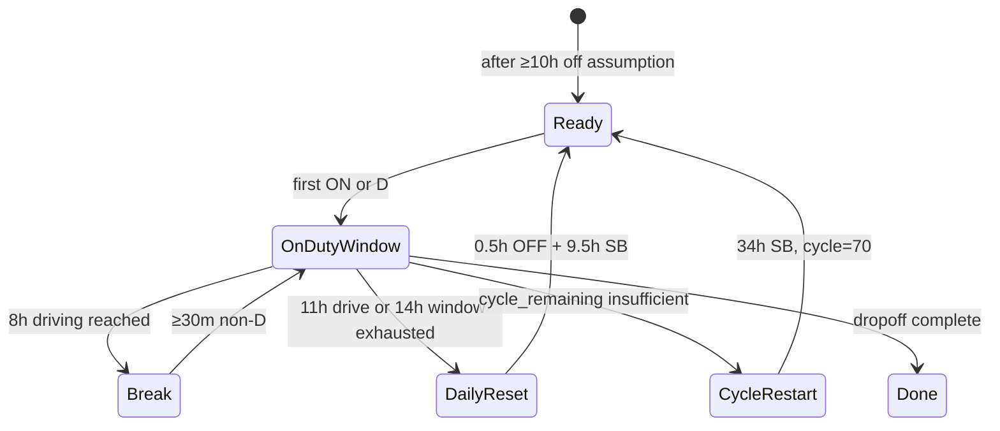
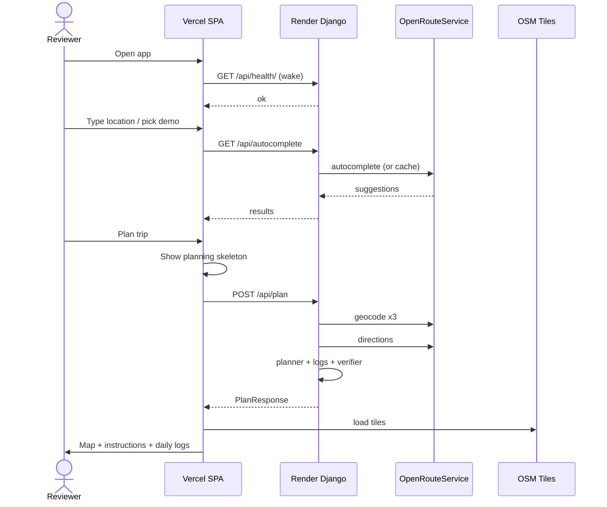
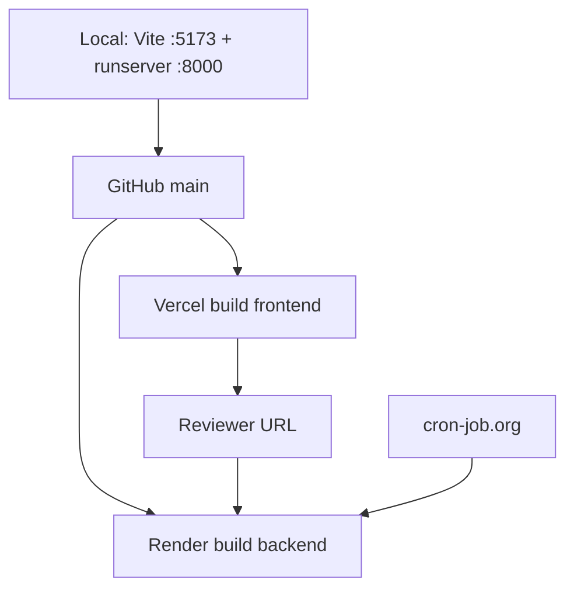

# System Architecture & User Flows
# Spotter HOS Trip Planner (Assessment)

**Status:** Design authority for implementation  
**Aligned to:** `PRD.md` v4.1 · `TRD.md` v4.1  
**Constraint:** **$0** infra — Vercel Free + Render Free + OpenRouteService Free + OSM + GitHub + Loom  
**Goal:** Reviewer cannot reject on missing features, dead hosting, or obvious HOS errors

---

## 1. Design thesis (why this shape)

The assessment is not a SaaS platform. It is a **single-purpose planning engine** with a polished UI.

| Pressure | Architecture choice |
|---|---|
| Free hosting only | Stateless API (no Postgres/Redis). Ephemeral disk OK. |
| Render sleeps after ~15m | Health wake on FE load + optional cron ping |
| ORS free quota | Server-side key, LRU cache, debounced autocomplete, demo cities |
| Accuracy graded on hosted app | Pure `planner` + `verifier` modules, unit-tested, no UI math |
| UI graded heavily | React + MUI; logs are SVG (drawn), not tables |
| Django won’t run on Vercel | Split: Vercel = SPA, Render = API |
| 16h cap | No auth, no DB trips, no Docker/Redis/RN in this repo |

**Core loop:**  
`User inputs → Django plans legally → JSON → React paints map + instructions + daily logs`

---

## 2. High-level system context



### Trust & secrets
| Secret | Lives where | Never |
|---|---|---|
| `ORS_API_KEY` | Render env | Browser, GitHub, Vercel |
| `DJANGO_SECRET_KEY` | Render env | Repo |
| `VITE_API_BASE_URL` | Vercel env (public URL only) | Must not point at localhost in prod |

---

## 3. Free-tier reality (design around failure modes)

### 3.1 Render Free
| Behavior | Impact | Mitigation in design |
|---|---|---|
| Sleep after ~15 min idle | First request 30–60s or timeout | FE wakes `/api/health/` on mount; UX shows “Waking API…”; README + optional cron |
| Ephemeral filesystem | SQLite wiped on restart | **No trip persistence** — plan is stateless POST |
| Limited CPU/RAM | Long coast-to-coast plans slower | Cap ORS timeouts; stream clear errors; cache geocodes |
| Cold start + CORS | Easy to misconfigure | Exact Vercel origin in `CORS_ALLOWED_ORIGINS` |

### 3.2 Vercel Free
| Behavior | Impact | Mitigation |
|---|---|---|
| Static SPA only | Cannot host Django | API on Render |
| Build-time env bake | Wrong API URL if unset | Set `VITE_API_BASE_URL` before build; document smoke test |
| Instant CDN | Fast UI | Primary submission URL = Vercel |

### 3.3 OpenRouteService Free
| Behavior | Impact | Mitigation |
|---|---|---|
| Daily request limits | Autocomplete can burn quota | Debounce 300ms; min 3 chars; LRU cache; demos use known cities |
| Key required | Deploy fails without it | Day-0 signup; `.env.example`; clear 502 messages |
| HGV profile may fail | Truck routing unavailable | Fallback `driving-car` + assumption flag in UI |

### 3.4 OSM tiles
- Free with attribution required on map  
- No API key  
- Fine for assessment traffic  

### 3.5 What we deliberately do NOT add (keeps free + reliable)
- Redis (paid on Render typically; in-memory LRU is enough)  
- Postgres (unnecessary for stateless plan)  
- Docker (extra deploy surface; Render native Python is simpler on free)  
- Google Maps (billing risk)  

---

## 4. Logical architecture (inside the monorepo)



### Layer rules (non-negotiable)
1. **Views are thin** — validate → call service → return JSON  
2. **`planning/` is pure logic** where possible — testable without HTTP  
3. **Never compute HOS in the frontend** — FE only renders API truth  
4. **Verifier runs after every plan** — illegal timeline = 500 integrity error (should never ship)  

---

## 5. Repository structure (created)

```text
spotter/
├── PRD.md
├── TRD.md
├── SYSTEM_ARCHITECTURE.md          ← this file
├── README.md
├── .gitignore
├── backend/
│   ├── manage.py
│   ├── requirements.txt
│   ├── runtime.txt
│   ├── .env.example
│   ├── config/                     # Django project
│   │   ├── settings.py
│   │   ├── urls.py
│   │   ├── wsgi.py
│   │   └── asgi.py
│   └── planning/                   # domain app
│       ├── constants.py
│       ├── types.py
│       ├── exceptions.py
│       ├── cache_util.py
│       ├── geo.py
│       ├── geocode.py              # stub → implement
│       ├── routing.py              # stub → implement
│       ├── hos_planner.py          # stub → implement
│       ├── hos_verifier.py         # stub → implement
│       ├── logs_builder.py         # stub → implement
│       ├── instructions.py         # stub → implement
│       ├── serializers.py
│       ├── views.py
│       ├── urls.py
│       ├── apps.py
│       └── tests/
└── frontend/
    ├── package.json
    ├── vite.config.ts
    ├── index.html
    ├── .env.example
    └── src/
        ├── main.tsx
        ├── App.tsx
        ├── theme.ts
        ├── api/
        ├── components/
        ├── constants.ts
        └── styles/print.css
```

---

## 6. Runtime request architecture

### 6.1 Health / wake
```text
Browser loads Vercel SPA
  → GET {API}/api/health/   (fire-and-forget)
  → if slow: show "Starting server…"
  → when ok: form enabled / ready
```

### 6.2 Autocomplete
```text
User types ≥3 chars (debounce 300ms)
  → GET /api/autocomplete/?q=
  → cache hit? return
  → else ORS autocomplete → cache → JSON results
```

### 6.3 Plan (main path)
```text
POST /api/plan/ {
  current_location, pickup_location, dropoff_location,
  current_cycle_used_hours, start_datetime?
}
  1. Validate fields (400)
  2. Geocode ×3 (422 on fail) + cache
  3. Directions empty? + loaded (502 on fail)
  4. hos_planner.simulate(...)
  5. instructions + daily_logs (midnight split)
  6. hos_verifier.verify(...)  → fail closed
  7. 200 PlanResponse JSON
```

### 6.4 Response contract (conceptual)
```text
summary          → metric cards
places           → map endpoints
route.geometry   → polyline
route.stops      → markers (fuel/break/rest/PU/DO)
instructions[]   → timeline list
daily_logs[]     → SVG sheets
assumptions[]    → trust banner
timeline[]       → optional debug / Loom
```

---

## 7. Domain / HOS engine architecture



### Clocks (single source of truth in `HosState`)
| Clock | Meaning |
|---|---|
| `window_start` | First ON/D after reset |
| `driving_in_window` | Toward 11h |
| `driving_since_break` | Toward 8h |
| `miles_since_fuel` | Toward 1000 mi |
| `cycle_remaining` | 70 − used − on-duty so far (approx model) |

### Ensure order (deterministic — critical for accuracy)
Before each risky chunk:
1. **Cycle** → maybe 34h SB  
2. **Daily window / 11h** → maybe 10h reset  
3. **Break / fuel** → OFF 0.5 or fuel ON 0.5  
4. **Pre-trip** → 0.5h ON if starting drive in new window  

### Two time concepts (do not conflate)
| Concept | Used for |
|---|---|
| HOS consecutive clocks | Legality of driving |
| Calendar midnight (`America/Chicago`) | Splitting daily log sheets |

---

## 8. Data flow (end-to-end sequence)



---

## 9. Detailed user flows

### Flow A — Happy path (manual trip)
1. Land on branded plan screen (product name, one line, form).  
2. App silently wakes API. If cold, subtle “Starting server…” (do not block forever; allow retry).  
3. User fills Current / Pickup / Dropoff via autocomplete; sets Cycle Used; optional start time.  
4. Clicks **Plan trip**.  
5. Loading state on CTA; form disabled.  
6. Success: scroll/reveal results:
   - Summary cards (miles, hours, days, cycle remaining)
   - Assumptions alert (70/8 approx, TZ, start-after-10h)
   - Map (route + stop markers) beside instruction list
   - Daily log tabs (Day 1…N), drawn SVG with remarks/brackets
7. User can switch log days, click instruction to highlight marker, copy share link, print logs.

### Flow B — Demo chip (reviewer speed path) **most important for pass**
1. Click **Long haul** (or Short / Cycle pressure).  
2. Form autofills known-good US cities + cycle.  
3. One click Plan → same results as A.  
4. Guarantees reviewer sees fuel, rests, multi-day logs without typing.

### Flow C — Geocode failure
1. Bad address submitted.  
2. API 422 `GEOCODE_FAILED` with which field.  
3. Inline error: “Could not find ‘X’. Try City, ST.”  
4. No partial broken map.

### Flow D — Route / ORS failure
1. ORS down or quota.  
2. 502 `ROUTE_FAILED` / friendly message.  
3. Suggest retry or demo chip (cached path still may need ORS for directions — demos should be re-runnable; cache geocode at least).

### Flow E — Cycle pressure
1. Cycle used = 68, medium distance.  
2. Plan inserts **34h SB restart**.  
3. UI shows restart in instructions + map marker + log days spanning restart.  
4. Verifier still clean.

### Flow F — Share link (no DB)
1. After plan (or from form), copy URL with query params.  
2. Peer opens link → form hydrates → they hit Plan (recompute; free/stateless).  
3. Not a saved server trip — honest and free-safe.

### Flow G — Cold start during grading
1. Reviewer opens Vercel after hours idle.  
2. Health wake starts; if plan clicked early, client retries once on network error / shows wake message.  
3. cron-job.org (optional) reduces odds of sleep during the review window.

---

## 10. Frontend information architecture

```text
┌─────────────────────────────────────────────────────────┐
│  Brand / product name                                   │
│  One supporting line                                    │
│  [Demo: Short] [Long] [Cycle]     [Copy share link]     │
│  Form: Current | Pickup | Dropoff | Cycle | Start       │
│  [ Plan trip ]                                          │
└─────────────────────────────────────────────────────────┘
                         │ success
                         ▼
┌──────────────┬──────────────────────────────────────────┐
│ Summary      │ Assumptions banner                       │
├──────────────┴──────────────────────────────────────────┤
│  Map (Leaflet)           │  Instructions list            │
│  markers synced ◄──────► │  click highlights marker      │
├─────────────────────────────────────────────────────────┤
│  Daily Logs  [Day1][Day2]…                              │
│  ┌──────────────────────────────────────────────────┐   │
│  │ SVG paper log (grid, brackets, remarks, totals)  │   │
│  └──────────────────────────────────────────────────┘   │
│  Print                                                    │
└─────────────────────────────────────────────────────────┘
```

**States:** `idle` · `waking` · `ready` · `planning` · `success` · `error`  

---

## 11. Backend module responsibilities

| Module | Responsibility | Failure mode |
|---|---|---|
| `geocode.py` | Resolve text → Place; autocomplete proxy | GeocodeFailed |
| `routing.py` | ORS directions → RouteLeg + geometry | RouteFailed |
| `geo.py` | Haversine, interpolate stop on polyline | — |
| `hos_planner.py` | Build legal DutySegment timeline | Planning logic bugs caught by verifier |
| `hos_verifier.py` | Independent legality checks | PlanIntegrityError |
| `logs_builder.py` | Midnight split, 24h reconcile, grid segs | Day≠24 fails verify |
| `instructions.py` | Human timeline for UI | — |
| `cache_util.py` | In-process TTL LRU | Lost on sleep — OK |
| `views.py` | HTTP adapter | Map exceptions → status codes |

---

## 12. Caching strategy (free substitute for Redis)

```text
Key: normalized query string / coordinate pair
Store: process memory LRU (max ~256, TTL 24h)
Use for: geocode + autocomplete
Not for: full plan results (too large; correctness prefers recompute)
```

When Render sleeps, cache clears — acceptable. Cron keep-warm preserves process longer during review days.

---

## 13. Error model (consistent UX)

| code | HTTP | User-facing intent |
|---|---|---|
| `VALIDATION_ERROR` | 400 | Fix form fields |
| `GEOCODE_FAILED` | 422 | Clearer City, ST |
| `ROUTE_FAILED` | 502 | Retry / check ORS |
| `PLAN_INTEGRITY_ERROR` | 500 | Shouldn’t happen — log + fix |
| `INTERNAL_ERROR` | 500 | Generic retry |

Body shape:
```json
{ "error": { "code": "...", "message": "...", "fields": {} } }
```

---

## 14. Deployment topology (pass-oriented)



**Submit:** Vercel URL + GitHub + Loom.  
**README must say:** first load may wake API ~1 minute.

---

## 15. Security & abuse on free tiers

- ORS key server-side only  
- CORS allowlist = Vercel origin (+ localhost for dev)  
- Light throttle on `/api/plan/` (e.g. 60/hour/IP) to protect ORS quota  
- `DEBUG=False` in prod  
- No PII storage (stateless)  

---

## 16. Performance budgets (free hardware)

| Path | Target | Notes |
|---|---|---|
| Health after warm | &lt; 300ms | |
| Health after sleep | ≤ 60s | UX must explain |
| Autocomplete | &lt; 1.5s | cache helps |
| Plan short | &lt; 5s | |
| Plan long | &lt; 8–12s | show progress copy |

---

## 17. Testing architecture

```text
planning/tests/
  test_verifier.py      # illegal timelines rejected
  test_planner.py       # fixtures A/B/C properties
  test_logs_builder.py  # 24h days, multi-day split
  test_api.py           # validation + happy path (mock ORS)
```

**Rule:** Mock ORS in CI/unit tests; live ORS only for manual/prod demos.

---

## 18. Observability (minimal, free)

- Django logging: plan duration, ORS status, cache hit/miss  
- No paid APM  
- Health endpoint for uptime pings  

---

## 19. What “good system design” means for this job

Spotter wants someone who ships **algorithm + API + UI**. This architecture:
- Puts the **HOS decision engine** at the center (not a thin CRUD app)
- Surfaces algorithm outputs clearly (instructions, stops, assumptions, logs)
- Stays **pragmatic under free constraints** (stateless, cache in-memory, wake strategy)
- Avoids resume-bonus theater (Redis/Docker) that destabilizes free deploy

---

## 20. Implementation order (after this doc)

1. Finish Django settings/urls + health endpoint  
2. FE shell theme + wake + form  
3. ORS geocode/route + map  
4. Planner + verifier + tests  
5. Logs SVG  
6. Polish demos/share/print  
7. Deploy early, smoke demos, Loom  

---

## 21. Checklist: free-constraint readiness

- [ ] No paid services required  
- [ ] Stateless plan (survives Render disk wipe)  
- [ ] Health wake + optional cron  
- [ ] ORS key only on server + LRU cache  
- [ ] HGV→car fallback  
- [ ] CORS locked to Vercel  
- [ ] Demo chips for zero-typing review  
- [ ] Verifier fail-closed  
- [ ] Assumptions visible (70/8 honesty)  

---

**Document control:** v1.0 — 2026-08-25
