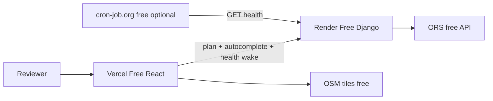

# TRD: Spotter HOS Trip Planner + Drawn Daily Logs

**Version:** 4.1 (aligned to PRD v4.1 — no bonus-infra scope creep)  
**Product authority:** `PRD.md`  
**Build authority:** this document  
**Cost target:** **$0** infra + maps  
**Stack:** Django 5 + DRF · React + TS + **MUI** · OpenRouteService · Leaflet  
**Host:** Vercel Hobby (FE) · Render Free (BE) · GitHub · Loom free  

**Explicitly not in this repo:** Redis, Docker/K8s, GCP, React Native — job-posting bonuses for **resume/Loom**, not assessment deliverables.

---

## 1. Purpose

Ship a **complete** assessment product that maps 1:1 to the role’s core duties (React+MUI, Django/DRF, algorithmic HOS logic in the UI):

**inputs → HOS-legal timeline → map + instructions → video-faithful multi-day drawn logs**

Use AI to compress ~1 week of implementation into the assessment time cap. Polish required features deeply; do not spend hours on bonus infra.

---

## 2. Free system context



**Rules**
- ORS key only on Render  
- Stateless planning (no Postgres required → stays free/simple)  
- Django still uses default SQLite file on instance (ephemeral OK; unused for trips)

---

## 3. Free services checklist

| Service | Signup | What you get |
|---|---|---|
| GitHub | github.com | Public repo, Actions optional |
| OpenRouteService | openrouteservice.org/dev/#/signup | Free API key (geocode/directions/autocomplete) |
| Render | render.com | Free Python web service (sleeps when idle) |
| Vercel | vercel.com | Free Vite/React hosting |
| Loom | loom.com | Free 3–5 min recording |
| cron-job.org | optional | Free HTTP ping to prevent sleep during review |

**Forbidden for this project:** Google Maps billing, Mapbox paid, paid Render/Vercel plans, custom paid domains.

---

## 4. Repository layout

```
spotter/
  README.md
  PRD.md
  TRD.md
  backend/
    manage.py
    requirements.txt
    runtime.txt              # python-3.12.x
    config/
      settings.py
      urls.py
      wsgi.py
    planning/
      constants.py
      geo.py
      geocode.py
      routing.py
      hos_planner.py
      hos_verifier.py
      logs_builder.py
      instructions.py
      serializers.py
      views.py
      urls.py
      exceptions.py
      cache_util.py
      tests/
  frontend/
    package.json
    vite.config.ts
    index.html
    src/
      main.tsx
      App.tsx
      theme.ts
      api/
      components/
      styles/print.css
```

---

## 5. Config / env

### Backend (Render)
```
DJANGO_SECRET_KEY=
DJANGO_DEBUG=False
DJANGO_ALLOWED_HOSTS=.onrender.com
CORS_ALLOWED_ORIGINS=https://YOUR_APP.vercel.app
ORS_API_KEY=
HOME_TERMINAL_TZ=America/Chicago
```

### Frontend (Vercel)
```
VITE_API_BASE_URL=https://YOUR_SERVICE.onrender.com
```

`requirements.txt` MUST include at minimum:
`django`, `djangorestframework`, `django-cors-headers`, `gunicorn`, `httpx` (or `requests`), `python-dotenv`

---

## 6. Constants

```python
HOME_TERMINAL_TZ = "America/Chicago"
CYCLE_LIMIT_HOURS = 70.0
DAILY_DRIVE_LIMIT_HOURS = 11.0
DUTY_WINDOW_HOURS = 14.0
BREAK_AFTER_DRIVE_HOURS = 8.0
BREAK_DURATION_HOURS = 0.5
DAILY_RESET_OFF_HOURS = 0.5
DAILY_RESET_SB_HOURS = 9.5
RESTART_34_HOURS = 34.0
FUEL_EVERY_MILES = 1000.0
FUEL_DURATION_HOURS = 0.5
PICKUP_DURATION_HOURS = 1.0
DROPOFF_DURATION_HOURS = 1.0
PRETRIP_DURATION_HOURS = 0.5
ENABLE_PRETRIP = True
AVG_SPEED_MPH = 55.0
SAME_POINT_EPSILON_MILES = 0.5
DRAW_TICK_MINUTES = 15
HOUR_TOLERANCE = 0.01
ORS_PROFILE_PRIMARY = "driving-hgv"
ORS_PROFILE_FALLBACK = "driving-car"
```

---

## 7. Domain model (summary)

- `DutyStatus`: OFF | SB | D | ON  
- `DutySegment`: status, start/end, miles, point, label, remark, stop_type, **stationary**  
- `HosState`: window + drive/break/fuel/cycle clocks + needs_pretrip  
- `RouteLeg`: geometry + cumulative miles for interpolation  

---

## 8. Integrations (all free)

### ORS
- Geocode search  
- Autocomplete  
- Directions geojson (attempt `driving-hgv` when ORS key present → `driving-car` fallback; free tier typically has no HGV — disclosed in UI assumptions)  
- Timeout 10s, 1 retry, LRU cache for geocode/autocomplete  

### OSM tiles
- Leaflet default OSM URL + attribution  

---

## 9. HOS planner / verifier

### Planner sequence
1. Validate inputs  
2. Geocode ×3  
3. Route empty leg if needed + loaded leg  
4. Simulate with ensure order: **cycle → window/daily reset → break/fuel → pretrip → drive chunks**  
5. Pickup 1h ON / dropoff 1h ON  
6. Instructions + daily logs  
7. **Verify** or fail  

### Daily reset
`OFF 0.5h` + `SB 9.5h`  

### 34h restart
`SB 34h`, `cycle_remaining = 70`  

### Verifier codes
`SEG_ORDER`, `DRIVE_11`, `WINDOW_14`, `BREAK_8`, `FUEL_1000`, `PICKUP_1H`, `DROPOFF_1H`, `CYCLE_70`, `RESET_10`, `DAY_24`

---

## 10. Logs + SVG

- Midnight split in `America/Chicago`  
- Reconcile day totals to 24.00  
- `bracket = stationary and status == ON`  
- SVG: header, grid, connectors, brackets, remarks, totals, recap note  
- `print.css` page-break per day  

---

## 11. API

| Method | Path | Purpose |
|---|---|---|
| GET | `/api/health/` | Liveness + wake target |
| GET | `/api/autocomplete/?q=` | ORS proxy |
| POST | `/api/plan/` | Full plan result |

Throttle plan endpoint lightly (e.g. 60/hr/IP) to protect free ORS quota.

CORS: exact Vercel origin.

---

## 12. Frontend requirements

- MUI themed freight UI  
- Autocomplete fields  
- Editable start datetime  
- Demo chips A/B/C  
- Health wake on app mount  
- Map + instruction sync  
- Daily log tabs + print  
- Assumptions banner  
- Share link: encode form inputs in URL query (`?current=&pickup=&dropoff=&cycle=&start=`) and hydrate on load  

---

## 13. Free deploy — exact procedure

### A. One-time prep
1. Create ORS key  
2. Monorepo on GitHub (`main` branch)  
3. Confirm locally: `uvicorn`/`runserver` + `vite` work with `.env`  

### B. Render Free (API) — do this early
```
Service type: Web Service
Repo: Spotter HOS Trip Planner (GitHub)
Root directory: backend
Build: pip install -r requirements.txt
Start: gunicorn config.wsgi:application --bind 0.0.0.0:$PORT
Plan: Free
```
Health check path: `/api/health/`

Notes:
- Free instances **sleep ~15m after idle**  
- First request after sleep: **30–60s** — expected  
- No Docker required on Render for basic Python  

### C. Vercel Hobby (UI)
```
Root: frontend
Build: npm run build (Vite default)
Output: dist
Env: VITE_API_BASE_URL=https://<render-service>.onrender.com
```

### D. Wire CORS
Set Render `CORS_ALLOWED_ORIGINS` to the Vercel URL → redeploy.

### E. Anti-sleep (free)
1. FE `useEffect` → `fetch(`${API}/api/health/`)` on load  
2. Optional: cron-job.org every 10 minutes → health URL during the days reviewers may look  

### F. Smoke test on production
1. Open Vercel URL  
2. Wait for wake if needed  
3. Run Demo B  
4. Confirm logs multi-day + map  

### G. Common free-tier failures
| Symptom | Fix |
|---|---|
| Vercel calls localhost | `VITE_API_BASE_URL` missing at **build** time → set env + redeploy |
| Browser CORS error | Exact origin match on Render; no trailing slash mismatch |
| 502 on first click | Cold start — retry; add wake + cron |
| ORS 403 | Key invalid/restricted; check dashboard |
| Gunicorn boot fail | `ALLOWED_HOSTS`, missing `requirements`, wrong `wsgi` path |

---

## 14. Local run (free)

```bash
# backend
cd backend
python -m venv .venv
.\.venv\Scripts\activate   # Windows
pip install -r requirements.txt
copy .env.example .env     # add ORS_API_KEY
python manage.py runserver

# frontend
cd frontend
npm install
echo VITE_API_BASE_URL=http://127.0.0.1:8000 > .env
npm run dev
```

---

## 15. Tests (AI writes, you verify)

Must have backend tests for verifier + fixtures A/C + day=24 + API validation.  
Run `python manage.py test planning` before each deploy.

---

## 16. Implementation order (AI-compressed)

1. Scaffold + Render/Vercel hello (URLs live)  
2. Theme + form + autocomplete UI  
3. ORS + map  
4. Planner + verifier + tests  
5. Logs SVG + print  
6. Sync/demos/share/assumptions  
7. Prod smoke + README + Loom  

---

## 17. Acceptance

Matches PRD §12 DoD. Extra free-stack gates:
- [ ] $0 services only  
- [ ] Production demo works after intentional 20-minute idle (wake path proven)  
- [ ] README documents free setup for anyone cloning  

---

## 18. Doc control

| Ver | Date | Note |
|---|---|---|
| 4.0 | 2026-08-25 | Full bar; free deploy playbook |
